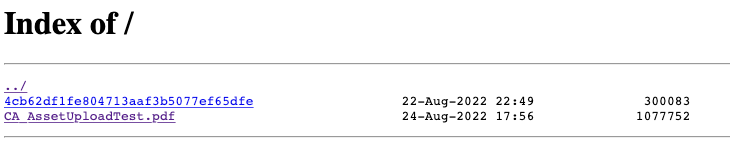

# local-file-tunnel

Create temporary local file server with ngrok tunnel.

If you don't set an `NGROK_AUTHTOKEN` in a `.env` file, you will be cursed with the ngrok session timeout.

## Usage

1. Start the server:
    ```
    bin/start
    ```
1. Copy a file to the server:
    ```
    bin/copy-file-to-container ~/Downloads/CA_AssetUploadtest.pdf.png
    ```
1. Get the `ngrok` URL: http://localhost:4040/status
   - Note: create a `.env` file and add `NGROK_AUTHTOKEN` to prevent the session from dying
1. Visit the `ngrok` URL to see files that you have uploaded

From there, you can submit URLs to the files being served for testing asset ingestion, i.e. `https://34f0-38-97-212-59.ngrok.io/CA_AssetUploadTest.pdf`


